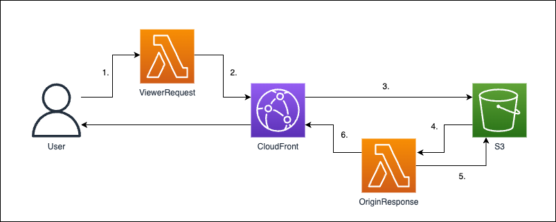

# zenn-cloudfront-resize-image


[](https://formulae.brew.sh/formula/aws-cdk)
[](https://nodejs.org/ja/)




1. Access the server at `https://your.domain.com/images/some_file.jpg?d=200x200`.
2. Use `Lambda@Edge` to transform the URL to `https://your.domain.com/images/200x200/webp/some_file.jpg`.
3. Access S3 using the transformed URL.
4. If the file exists in S3, proceed to step 6; if it doesn't exist, perform step 5.
5. Convert the image at the original access location, `images/some_file.jpg`, and save it as `images/200x200/webp/some_file.jpg`.
6. Return either the retrieved file or the converted file.


# zenn article

- [CloudFrontで画像をリサイズしつつ配信する](https://zenn.dev/gsy0911/articles/9bb40ea96fa3cb)

# deploy step

1. create `infra/params.ts` from example

```shell
$ cd infra
$ cp paramsExample.ts params.ts
```

2. prepare your domain in `Route53`
3. get Certificate of your domain in `ACM`

4. edit `params.ts` and set parameters
5. deploy via CDK

```shell
# in infrastructure directory
$ cdk ls
zenn-cf-resize-node-lambda
zenn-cf-resize-python-lambda
zenn-cf-resize-cloudfront

$ cdk deploy zenn-cf-resize-cloudfront
```

6. access your file
